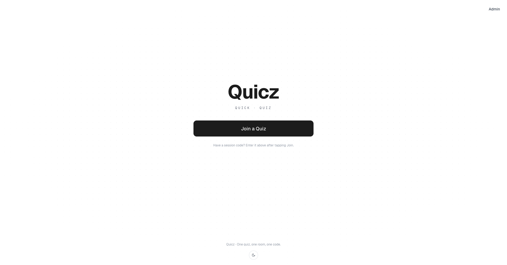
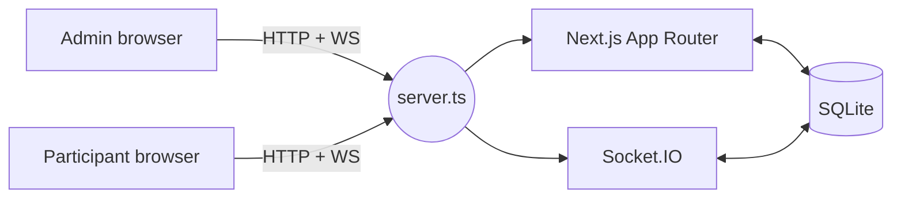

# Quicz

> **Quick Quiz** — a lean, self-hostable live quiz for the room you're already in. One code, one room, no signups.

[](./LICENSE)
[](https://nodejs.org/)
[](https://nextjs.org/)

## TL;DR

- **What it is** — a live quiz you run on your own laptop or server. Admin controls the flow, participants join with a 6-character code on any device.
- **Who it's for** — trainers, teachers, and workshop organisers who want a zero-account, zero-telemetry quiz tool that runs offline on a LAN.
- **Run it** — `cp .env.example .env && docker compose up -d` and open <http://localhost:3000>.

## Screenshots



## Description

Quicz is a lean, self-hostable live quiz application for training sessions and workshops. It supports admin-controlled quiz flow with real-time audience participation, live result distribution, per-question correctness reveal, and a final scoreboard.

Participants join via a 6-character session code on any device — no account, no install. The admin drives the session (open voting → lock → show distribution → reveal answer → next question) from a presenter control panel, and can export all responses as CSV.

### Why Quicz?

- **Self-hosted by design.** Everything runs in one Node process with a SQLite file. No managed service, no external API, no telemetry.
- **Offline-friendly.** Works on a laptop on a LAN with no internet connection — useful for workshops in rooms with flaky Wi-Fi.
- **No accounts.** Participants type a code and a display name. That's it.
- **Small surface area.** One binary, one port, one database file. Easy to audit, easy to back up, easy to throw away.
- **Open.** AGPL-licensed — if you fork it and run it as a service, your users get the source.

### Features

- Single-choice, multiple-choice, and binary (true/false) questions
- Optional per-question time limit with automatic lock
- Live answer-count indicator for participants
- Admin-controlled reveal: distribution first, correct answer on demand
- Per-participant correctness delivered privately (no leaking others' answers)
- Final scoreboard with top-10 cut and "where am I" indicator below the cut
- CSV export of all responses per session
- Keyboard navigation for participants (arrows + Enter)
- Light/dark theme

## Technology Stack

| Framework | Language | Database | ORM | Realtime | Styling | Charts | Runtime |
|-----------|----------|----------|-----|----------|---------|--------|---------|
| Next.js 15 (App Router) | TypeScript (strict) | SQLite via `better-sqlite3` | Drizzle ORM | Socket.IO 4 | Tailwind CSS v4 | Recharts | Node.js 20+ |

## Dependencies

- Node.js 20+
- npm 9+
- (Optional) Docker + Docker Compose for containerised deployment

## Installation

### Local development

1. Clone the repository:
   ```bash
   git clone <repo-url>
   cd quicz
   ```

2. Install dependencies:
   ```bash
   npm install
   ```

3. Copy the environment file and set your values:
   ```bash
   cp .env.example .env
   ```

4. Run migrations (optional — they run automatically on server start):
   ```bash
   npm run db:migrate
   ```

5. Start the development server:
   ```bash
   npm run dev
   ```
   Open <http://localhost:3000>.

### Docker

```bash
cp .env.example .env
# Edit .env with your values
docker compose up -d
```

The app will be available at <http://localhost:3000>.

### Configuration

All configuration is via environment variables. Copy `.env.example` to `.env`.

| Variable | Required | Default | Description |
|----------|----------|---------|-------------|
| `ADMIN_PASSWORD` | ✅ | — | Password for the single admin account. |
| `SESSION_SECRET` | ✅ | — | Long random string used to HMAC-sign the admin cookie. |
| `DATABASE_URL` |  | `./data/quicz.db` | Path to the SQLite file. |
| `PORT` |  | `3000` | HTTP/WebSocket port. |

## Usage

### Admin

1. Go to `/admin` and log in with your `ADMIN_PASSWORD`.
2. Create a quiz under **Quizzes → New Quiz**.
3. Add questions (single-choice, multiple-choice, or binary) with correct answers marked.
4. Click **Start Session** to create a live session.
5. Share the 6-character session code (or the join URL / QR code) with participants.
6. Control the session from the **Presenter** panel:
   - **Start Quiz** — move from lobby to the first question
   - **Lock Voting** — stop accepting answers
   - **Show Results** — display answer distribution
   - **Reveal Answer** — show the correct answer and each participant's personal result
   - **Next Question** — advance
   - **Show Final Scoreboard** — display rankings
7. Export all responses to CSV from the **Results** page.

### Participants

1. Open the join URL (or scan the QR code) and enter the 6-character code.
2. Enter a display name.
3. Answer questions as they appear — navigate with ↑/↓ and press Enter to submit.
4. See your own result after each reveal and your final rank at the end.

## Architecture Diagrams

See [`docs/diagrams/architecture.md`](./docs/diagrams/architecture.md) for component and phase-machine diagrams.

In short: one Node.js process, one port, one SQLite file.



The detailed spec (data model, socket events, phase transitions) lives in [`DESIGN.md`](./DESIGN.md).

## Data & Privacy

- All data is stored locally in the SQLite file at `DATABASE_URL`. Nothing is sent to third parties.
- No telemetry, no analytics, no external tracking scripts.
- Sessions, participants, and responses persist in the database until you delete them. There is no automatic retention policy — back up or wipe `data/quicz.db` as you see fit.

## Known Issues & Roadmap

Quicz is not under active development. The items below may or may not be addressed — PRs welcome (see [`CONTRIBUTING.md`](./CONTRIBUTING.md)).

- Socket.IO room membership is lost if the server restarts mid-session. Session state survives in SQLite, but participants will need to reconnect and questions may need to be manually re-locked by the admin.
- No rate limiting on join or answer submission endpoints.
- No pagination on quiz list or session history — fine for typical workshop scale, not for thousands of sessions.

## Contributing

Contributions are welcome but best-effort to review — see [`CONTRIBUTING.md`](./CONTRIBUTING.md) for expectations and ground rules.

## License

[GNU Affero General Public License v3.0 or later](./LICENSE). If you modify Quicz and run it as a network service, you must make your source available to its users.

