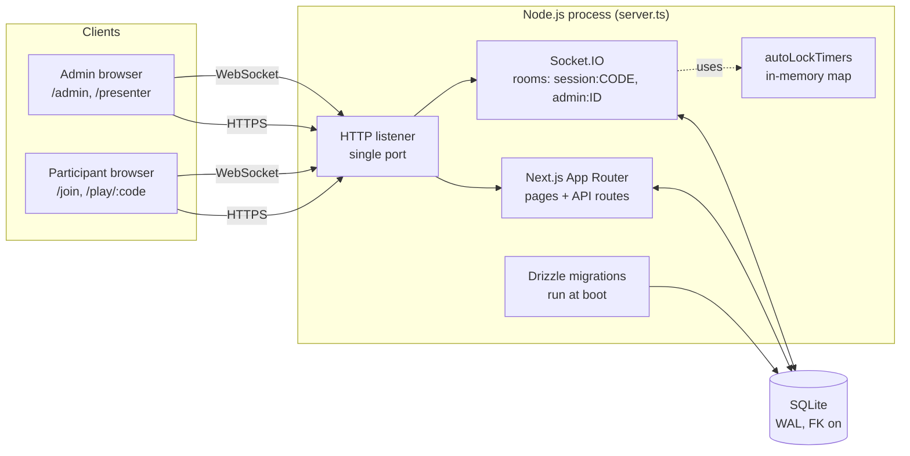
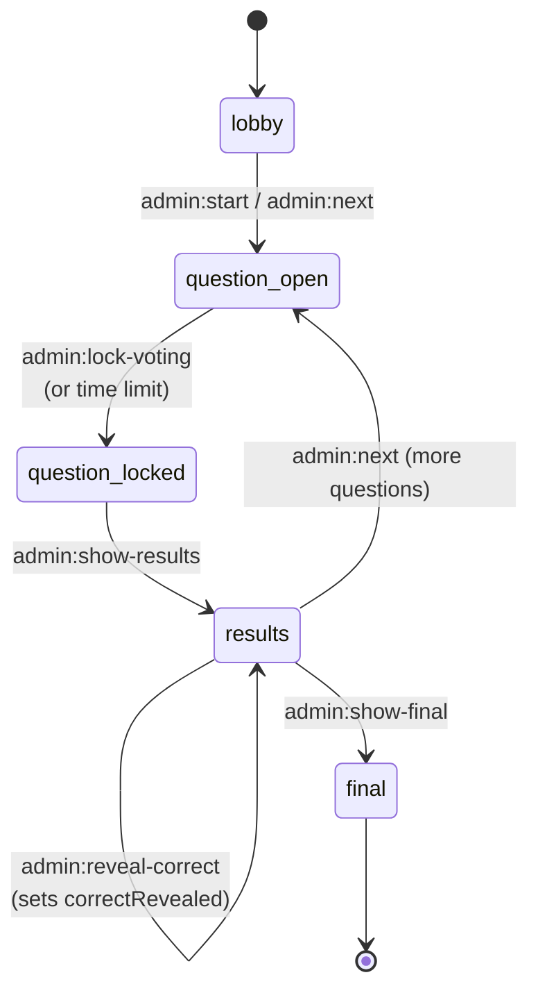

# Architecture

Quicz runs as a single Node.js process on a single port. A custom HTTP server
(`server.ts`) hosts both the Next.js request handler and a Socket.IO server,
sharing the same listener. SQLite (via Drizzle ORM and `better-sqlite3`) is
the single source of truth for session state; Socket.IO is used only as a
broadcast mechanism.

## Component diagram

## Session phase machine

See `DESIGN.md` for the full event and payload reference.
